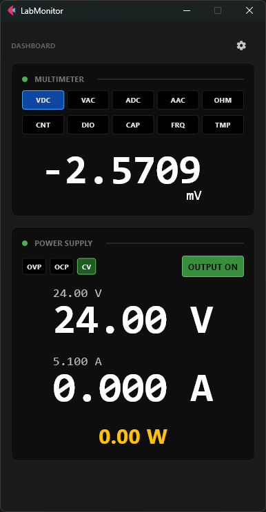

# LabMonitor



[](https://www.python.org/downloads/)
[](https://flet.dev/)
[](https://opensource.org/licenses/MIT)

**LabMonitor** is a professional, high-visibility Windows application designed for electronics livestreams and bench work. It provides real-time monitoring of professional lab equipment with a focus on camera readability and reliability.

## 🚀 Features

- **Dual-Instrument Monitoring**:
  - **Owon XDM1041 Multimeter**: Live SCPI-based measurements (V, A, Ω, F, etc.) with auto-scaling and mode detection.
  - **Korad KA3005PS PSU**: Real-time Voltage, Amperage, and Wattage tracking with status indicators (CV/CC, OVP, OCP).
- **Livestream Optimized**: Large, high-contrast digital fonts designed to be crystal clear through OBS or webcams.
- **Persistent Configuration**: Save your COM port settings and customize theme colors (background and font) through an intuitive settings menu.
- **Resilient Connectivity**: Built-in auto-reconnect logic and a **Simulation Mode** for software testing without physical hardware.
- **Standalone Build**: Designed to be compiled into a single portable `.exe` for easy deployment.

## 🛠️ Tech Stack

- **Core**: Python 3.12
- **UI Framework**: [Flet](https://flet.dev/) (Flutter-integrated visuals for high performance)
- **Serial Communication**: `pyserial`
- **Build Tool**: `flet build windows`

## 📦 Installation & Setup

1. **Clone the repository**:
   ```bash
   git clone https://github.com/Krhomv/LabMonitor.git
   cd LabMonitor
   ```

2. **Setup Virtual Environment**:
   ```bash
   python -m venv .venv
   .\.venv\Scripts\activate
   ```

3. **Install Dependencies**:
   ```bash
   pip install -r requirements.txt
   ```

4. **Run the Application**:
   ```bash
   python main.py
   ```

## ⚙️ Configuration

Access the settings via the **Gear Icon** in the top right corner to:
- Select COM ports for your Multimeter and PSU.
- Choose "Simulated" for testing.
- Customize the matrix/background colors to match your stream aesthetic.

## 📜 License

This project is licensed under the MIT License - see the LICENSE file for details.

## 🚀 Releases & Deployment

This project uses **GitHub Actions** to automatically build and package the application for Windows.

### How to create a Release:
1.  **Tag the code**: Push a new tag to the repository (e.g., `v1.0.0`).
    ```bash
    git tag v1.0.0
    git push origin v1.0.0
    ```
2.  **Automated Build**: GitHub will automatically trigger a build, package the app into a `.zip` file, and create a new Release on your GitHub page with the executable attached.

---

*Built with ❤️ for the FPV and Electronics community.*
