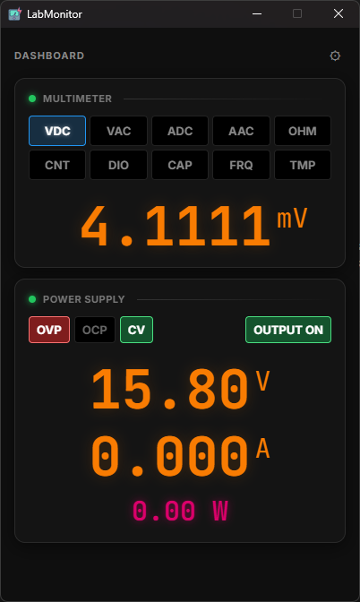

# ⚡ LabMonitor  `v1.0.0`

LabMonitor is a high-performance, ultra-lightweight desktop dashboard built to monitor electronics lab hardware in real-time. Originally prototyped in Python/Flet, the project has been fully architected on **Rust + Tauri** and **React**, resulting in instant startup times, practically zero background overhead, and an incredibly responsive SCPI hardware polling loop.



## ✨ v1.0 Features

- **Robust Hardware Support**: Native serial-port integration for **Owon XDM Series Multimeters** (e.g., XDM1041) and **Korad Power Supplies** (e.g., KA3005P, KD3005P).
- **Embedded OBS Overlay Server**: Built-in HTTP server (`warp`) that serves live, transparent-background HTML overlays for your devices. Perfect for electronics repair streams or tutorials.
- **Smart PSU Display**: Interactive readout that shows **Set Values** (in dim gray) when output is off, and **Live Output** (in full theme color) when output is on.
- **Unified Sizing**: Perfectly aligned units and centered displays across both PSU and Multimeter views for a cohesive, professional look.
- **Deep Customization**: Native color pickers allow you to theme every aspect of the dashboard—from the mode chips to the ambient card backdrops and dynamic Watts/VDC glows.
- **Zero-Latency Monitoring**: Utilizing Rust's thread management, the raw SCPI polling loop stays completely decoupled from the frontend rendering, grabbing device states seamlessly without spiking your CPU.

## 🎬 OBS Integration

LabMonitor includes a lightweight HTTP server to serve your device data to OBS as a **Browser Source**.

1. **Configure**: Open settings gear `⚙` and set your preferred port (default: `8765`).
2. **Endpoints**:
   - Owon Multimeter: `http://localhost:8765/overlay/owon`
   - Korad PSU: `http://localhost:8765/overlay/korad`
3. **Add to OBS**: Create a new **Browser Source**, paste the URL, and set the background to transparent.
   - The overlays poll at **150ms** for smooth, low-latency updates.
   - They dynamically inherit your custom theme colors (glows, font colors) from the main app.

## 🚀 Getting Started

### Prerequisites
- [Node.js](https://nodejs.org/) & npm
- [Rust](https://www.rust-lang.org/tools/install)

### Installation

1. Clone the repository:
   ```bash
   git clone https://github.com/Krhomv/LabMonitor.git
   cd LabMonitor
   ```

2. Install the frontend dependencies:
   ```bash
   npm install
   ```

3. Fire up the development environment (featuring hot-reload):
   ```bash
   npm run tauri dev
   ```

4. Compile the binaries:
   ```bash
   npm run tauri build
   ```
   - **Standalone Portable**: `src-tauri/target/release/labmonitor.exe` (Run directly, no install needed)
   - **NSIS Installer**: `src-tauri/target/release/bundle/nsis/LabMonitor_1.0.0_x64-setup.exe`

## ⚙️ Configuration
Click the gear `⚙` icon in the top right to open the application settings. From here, you can map the background worker threads to your specific Windows COM ports (e.g., `COM3`, `COM4`), configure your OBS Overlay port, and instantly tweak the application's visual presence.

## 🛠️ Technology Stack
- **Frontend**: `React`, `TypeScript`, `Vite`, Native Vanilla CSS
- **Backend / OS Layer**: `Rust`, `Tauri v2`, `serialport`
- **Networking**: `warp` (high-performance HTTP), `tokio` (multi-threaded async runtime)
